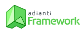
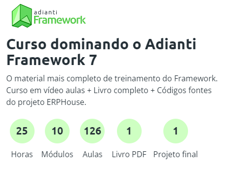

<h1 align="center">

</h1> 

# Repositório de Códigos do Curso Dominando o Adianti Framework 7

<h3 align="center"> 
	🚩 Em construção... 🚧 
</h3>

Este repositório é destinado ao aprendizado, contém os códigos desenvolvidos durante o Curso Dominando o Adianti Framework 7. Foi criado para armazenar e compartilhar o progresso e aprendizado adquiridos ao longo do curso oferecido pela Adianti Solutions.

## Sobre o Adianti Framework

O Adianti 7 é um framework PHP de código aberto, projetado para simplificar a criação de sistemas. Ele adota uma abordagem orientada a objetos que torna mais fácil a criação de interfaces de usuário dinâmicas, gerenciamento de banco de dados, formulários flexíveis, datagrids completas e oferece responsividade. Além disso, o framework possui recursos de templates e outras funcionalidades prontas para uso. Com suas capacidades robustas e uma ampla gama de componentes, o Adianti Framework é uma excelente escolha para o desenvolvimento de aplicações empresariais e sistemas de gerenciamento. 

## Sobre o Curso

O curso é composto por 10 módulos, abrangendo 126 aulas ao longo de um total de 25 horas. O curso é ministrado pelo renomado Pablo Dall'Oglio, graduado em Análise de Sistemas e mestre em Engenharia de Software; ele também é autor dos livros "PHP-GTK", "Criando aplicações gráficas com PHP" e "Criando relatórios com PHP". Com uma vasta experiência no desenvolvimento de sistemas para gestão de negócios, Pablo está constantemente envolvido em projetos e implementações de softwares orientados a objetos.

<h1>

</h1> 

